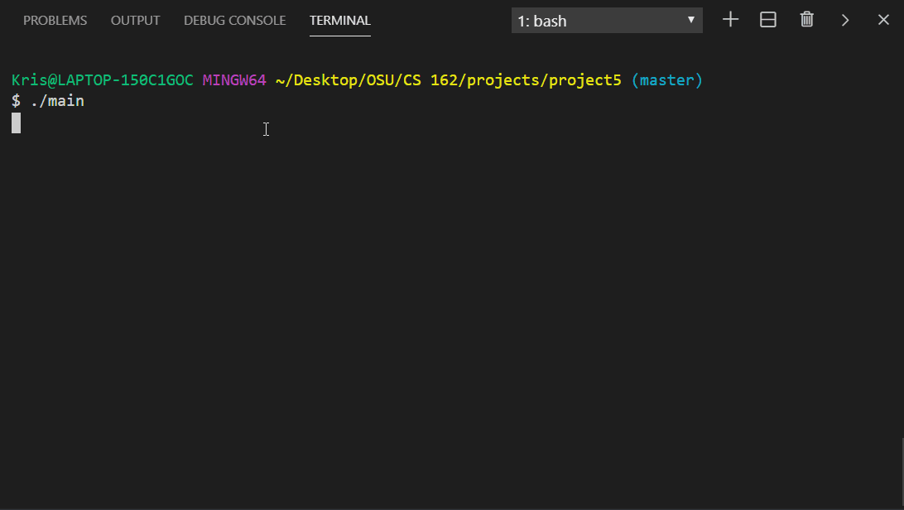

# Treasure Hunt - A Text-based Strategy Game

Treasure Hunt is a text-based game in the spirit of Zork. It takes the player through a vast estate, searching for clues and items to unlock the mystery of the uncle's will and greatest treasure.

It's coded in C++ and diplays all lines to the console. A gif is included to show the game's beginning.

## Build With

* C++

## Author

* **Kris Acker Bierma** - [KrisBierma](https://github.com/KrisBierma)

## License

This project is licensed under the MIT License - see the [LICENSE.md](LICENSE.md) file for details

